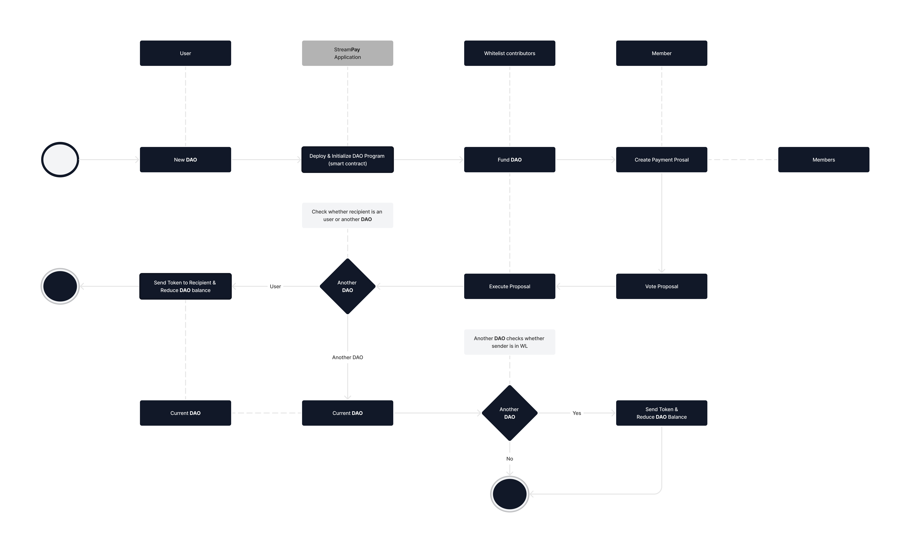
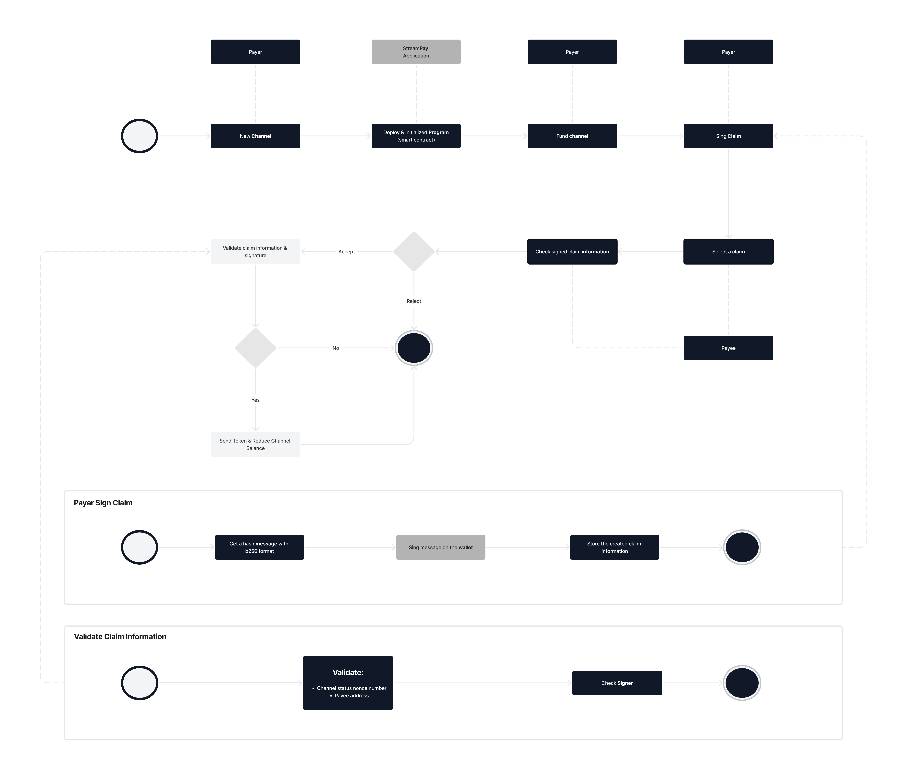
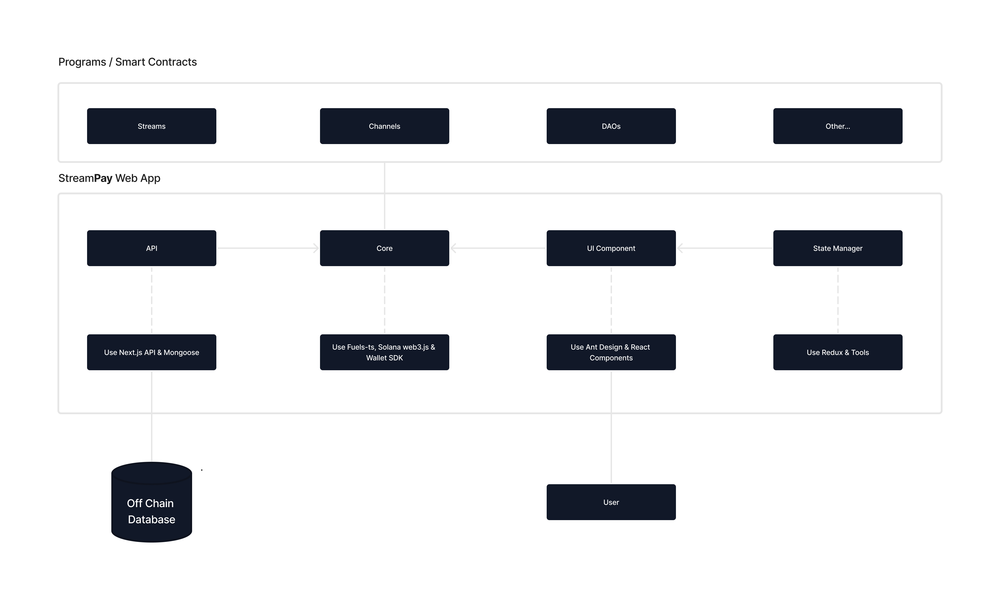

# Project: StreamPay™ / StreamFinance - Disbursement Platform

## Introduction

StreamPay™ operates on the Solana and FUEL testnet and offers a seamless DAO creation experience, eliminating the need for coding knowledge within organizations. Fuel Blockchain is The World's Fastest Modular Execution Layer. The StreamPay platform facilitates smooth payments to users and other DAOs through Payout and Funding proposals, supported by transparent voting mechanisms. Our product also provides Crypto streaming and Payment channels for real-time transactions with minimal gas fees. With decentralized contract (programs) deployment for each DAO, Stream, or Channel, StreamPay™ / StreamFinance ensures secure and efficient fund management.

Our vision extends beyond payments; we plan to integrate StreamPay™ into remote jobs markets, empowering users with transformative features.

## Table of Contents

1. Overview
2. Key Features
3. How StreamPay™ Platform Works
    - DAO & Payment Management
    - Crypto Streaming
    - Payment Channels
4. Use Cases
5. Technical Implementation
6. Future Developments
7. Conclusion

## 1. Overview
StreamPay™ aims to offer payment solutions catering to both DAOs and Individuals. Our primary target audience consists of Solana, StreamPay and FUEL users seeking seamless payroll, funding, and vesting solutions. By providing these services, we strive to contribute to the growth and expansion of the ecosystems.

## 2. Key Features

### DAO Creation without Coding:
StreamPay™ empowers organizations to effortlessly create DAOs through an intuitive interface, allowing for easy configuration of DAO parameters, governance rules, and voting mechanisms. By eliminating the complexities of coding, StreamPay™ becomes accessible to a broader range of users.

### Transparent Governance with Voting Mechanism:
Within each DAO, StreamPay™ / StreamFinance allows users to propose Payouts and Funding requests. The community participates in a democratic voting process to approve or reject these proposals, ensuring transparency and effective fund management.

### Seamless Payments and Payouts:
StreamPay™ facilitates seamless payments to individual users and other DAOs, including StreamDAO, both internally and externally. This feature fosters collaboration and financial interactions within the Solana and FUEL ecosystem.

### Crypto Streaming:
StreamPay™ introduces Crypto streaming, a cutting-edge feature that enables real-time payments based on continuous streams of funds. This dynamic payment method suits various use cases, such as subscription-based services.

### Payment Channels for Efficiency:
Leveraging Payment channels, StreamPay™ ensures near-instantaneous and cost-effective transactions for users. By reducing gas fees, this feature is especially advantageous for microtransactions and frequent transfers.

### Decentralized Contract Architecture: 
Each DAO, Crypto Stream, or Payment Channel in StreamPay™ is deployed as a separate Solana program and smart contract on the FUEL testnet. This decentralized architecture ensures enhanced security and mitigates risks, as no central contract holds all the funds.

## 3. How StreamPay™ Platform Works

### DAO & Payment Management
The primary flow of DAOs and Payment proposal management is as follows:

Additionally, the application offers several other features, including:

- Adding and removing members
- Joining and leaving open DAOs
- Updating whitelist contributors
- Accessing DAO and Treasury statistics.

### Crypto Streaming

The primary flow of a Stream is as follows:

**Additional features include:**

- Assigning privileges for canceling and transferring streams.
- Cancelling streams.
- Transferring streams.

To ensure fairness to both parties, users must possess the qualified assigned privilege when canceling or transferring a stream. In such cases, the remaining amount will be calculated and transferred to the recipient or sender accordingly. These measures guarantee a balanced and equitable user experience for all participants.

### Payment Channels

This is an MVP implementation for the payment channel concept. However, it still requires improvement to address critical security issues.

## 4. Use Cases

**StreamPay™ can be used for the following purposes:**

- **Managing DAO Treasury:** It allows payout to individuals or funding other organizations through transparent proposals and voting, facilitating efficient financial management within DAOs.

- **Paying Freelancer Salaries and Subscription Services:** StreamPay™ supports crypto and stablecoin streaming for payments, enabling freelancers to receive payments in real-time for their services or subscriptions. This feature provides security and transparency, protecting users in the labor market.

- **Transaction and Invoicing:** StreamPay™ facilitates multiple transactions between parties, such as buyers and service providers. Each payment is confirmed and accepted through a claim, akin to a traditional invoice. Additionally, it is suitable for micropayments, reducing transaction fees and costs for payers and other payment engines built on the Solana blockchain.

## 5. Technical Implementation

**Creating an Architecture and Developing StreamPay™:**

- Developed a comprehensive UI/UX concept to outline the application's requirements and functionalities.

- Created a StreamPay program to collect transaction fees on the Solana blockchain.

- Utilized Rust and Solidity programming languages to write smart contracts, enabling efficient contract development.

- Implemented autotest scripts to ensure the robustness and reliability of the most crucial features.

- Designed an offchain database, initially considering indexer integration, but due to technical challenges, opted for a cloud-based MongoDB solution.

- Integrated StreamPay™ with Solana, fuels-ts, and wallet SDK to facilitate smooth interactions with the FUEL blockchain.

- Developed and wrote the core components of StreamPay™, laying the foundation for its various functionalities.

- Progressively completed the planned features

 according to our development roadmap.

## 6. Future Developments

At this phase, StreamPay™ serves as an MVP that represents the core ideas of our project. Due to the short duration of the hackathon, there is ample room for improvement and further enhancements to be made in future iterations of StreamPay™.

**Here are the planned enhancements and features for StreamPay™:**

1. Implement gasless deployment and initialization for all smart contracts, making it easier for users to interact with the platform.

2. Introduce token-based DAOs, providing greater flexibility and utility within the decentralized ecosystem.

3. Add Cross-Chain Support.

4. Expand proposal types to cover a wide range of payment and governance scenarios, enhancing the platform's functionality.

5. Support parent and children DAOs architecture to facilitate hierarchical organization structures and collaborations.

6. Introduce batch streams and channels deployment, streamlining the process for multiple transactions.

7. Implement a personal invoice system for users, enhancing transparency and ease of payment management.

8. Introduce a user's address book for convenient and efficient transactions between familiar parties.

9. Implement a user-friendly naming system to simplify StreamPay™ user addresses and improve user experience.

10. Combine the cloud-based Database and an indexer-based solution for enhanced scalability and data management.

11. Integrate Oracle services to bring real-world data onto the blockchain, expanding use cases and applications.

12. Add support for more tokens, increasing the diversity of assets available on StreamPay™.

13. Introduce support for crypto, fiat currencies, and stablecoins bridging the gap between traditional finance and the StreamPayments™ decentralized ecosystem.

14. Conduct a thorough audit of all smart contracts to ensure security and reliability.

15. Develop StreamPayments™ APIs and SDKs to enable easy integration and interaction with StreamPay™'s features.

16. Conduct research and expand business use cases to identify new opportunities and potential areas for growth.
